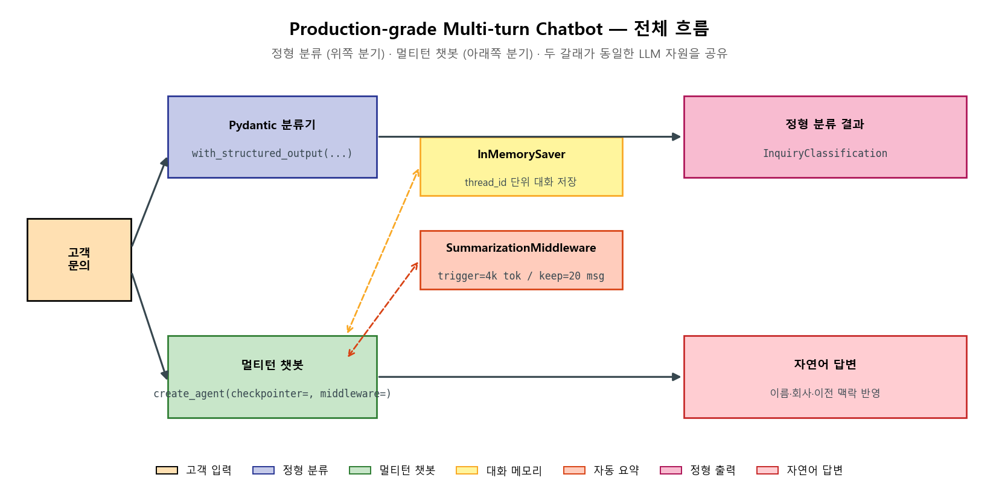
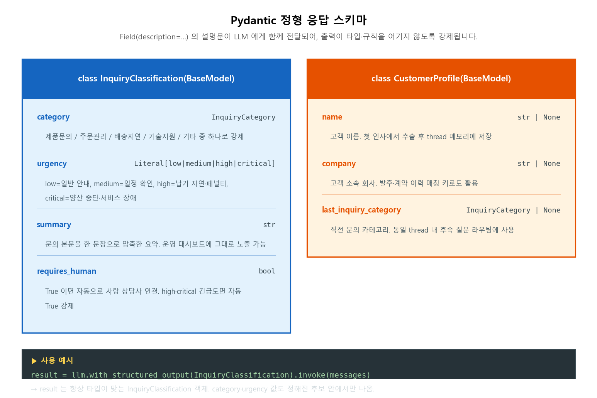
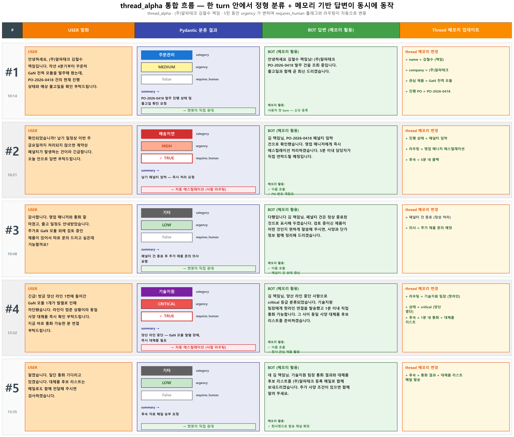
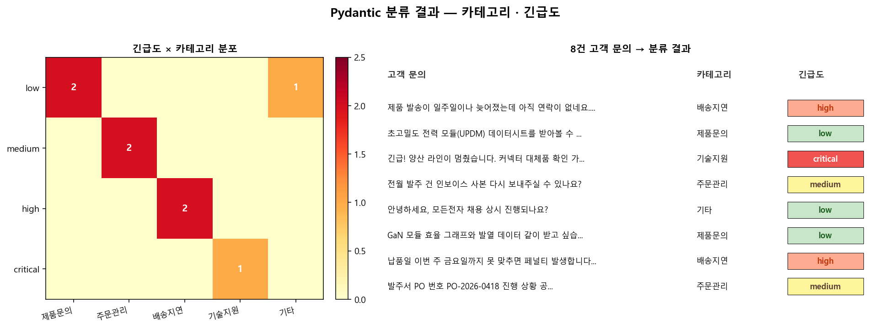
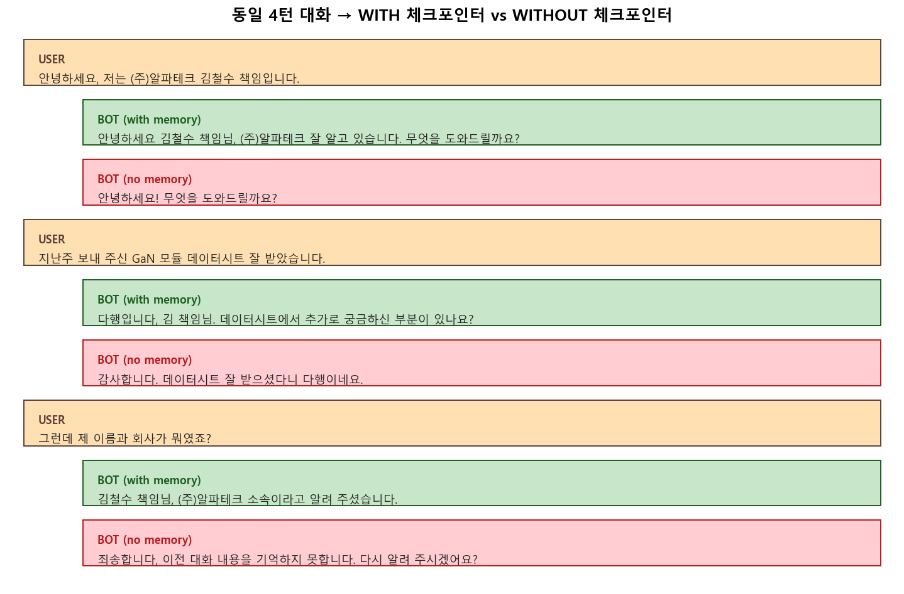
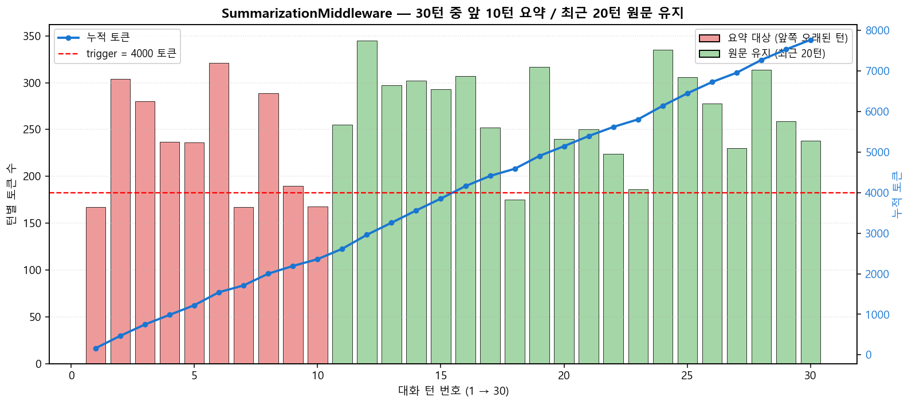
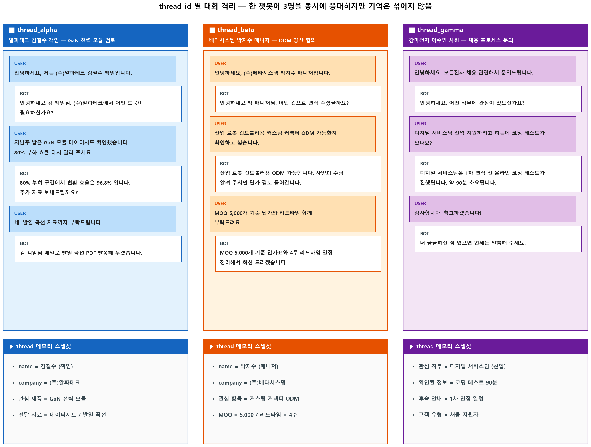

# 💬 LangChain Production-grade Multi-turn Chatbot
### **Pydantic 정형 응답 + InMemorySaver 대화 기억 + SummarizationMiddleware 자동 요약** — 실제 서비스에 가까운 멀티턴 챗봇 파이프라인


---

## 📌 프로젝트 요약 (Project Overview)

가상의 회사 "모든전자(Modeun Electronics)"의 고객 응대 챗봇을, 시연용을 넘어 **실제 서비스에서도 쓸 수 있는 형태**로 다듬어 본 프로젝트입니다. 앞선 RAG 챗봇이 한 번에 한 질문씩만 받고 응답도 매번 자유 문장으로만 나오던 한계를, 이번 단계에서는 **응답을 정형 데이터로 강제** 하고 **대화를 thread 단위로 기억** 하며 **대화가 길어지면 자동으로 요약 압축** 하는 세 가지 축으로 풀었습니다.

핵심 질문은 세 가지였습니다. **Pydantic 으로 LLM 출력을 강제하면 회사 시스템에 자동으로 꽂아 넣을 수 있는가 / 같은 챗봇이 여러 고객을 동시에 응대하면서 각자의 대화를 섞이지 않게 기억할 수 있는가 / 30턴 넘는 긴 대화에서도 토큰 비용이 폭주하지 않게 막을 수 있는가** — 이 세 가지를 코드로 검증하는 게 이 포트폴리오의 목표입니다.

---

## 🎯 핵심 목표 (Motivation)

| <br/>핵심 역량 &emsp;&emsp;&emsp;&emsp; | 상세 목표 |
| :--- | :--- |
| **정형 응답 강제 (Structured Output)** | `pydantic.BaseModel` 로 카테고리·긴급도·요약·상담사 연결 여부를 정의하고, `llm.with_structured_output(Type)` 으로 LLM 응답을 타입에 맞게 강제 |
| **대화 기억 (Multi-turn Memory)** | `InMemorySaver` 체크포인터를 `create_agent(checkpointer=...)` 에 등록하고, `thread_id` 단위로 대화 맥락을 보관 |
| **자동 요약 압축 (Token Budget)** | `SummarizationMiddleware(trigger=('tokens', 4000), keep=('messages', 20))` 으로 누적 토큰이 임계치를 넘으면 오래된 턴을 자동 요약 |
| **Thread 격리 (Isolation)** | 한 챗봇 인스턴스가 여러 `thread_id` 를 동시에 다뤄도, 각 스레드의 기억이 서로 섞이지 않게 분리 |

---

## 📂 프로젝트 구조 (Project Structure)

```text
├─ data/
│  └─ customer_inquiries.json                # 8건 고객 문의 (분류기 입력)
├─ results/
│  ├─ fig_01_pipeline_overview.png           # 분류 + 챗봇 + 메모리 + 요약 전체 흐름
│  ├─ fig_02_pydantic_schema.png             # Pydantic BaseModel 스키마 다이어그램
│  ├─ fig_03_classification_distribution.png # 8건 문의 분류 결과 (카테고리×긴급도)
│  ├─ fig_04_memory_comparison.png           # 체크포인터 ON/OFF 시 4턴 대화 비교
│  ├─ fig_05_summarization_flow.png          # 30턴 대화에 요약 미들웨어가 작동하는 모습
│  ├─ fig_06_thread_isolation.png            # thread_id 별 대화 격리 모습
│  └─ fig_07_alpha_thread_walkthrough.png    # thread_alpha 5턴 통합 흐름 (분류+메모리+라우팅)
├─ src/
│  └─ production_chatbot.py                  # 통합 실행 스크립트
├─ .gitignore
├─ README.md
└─ requirements.txt
```

---

## 🏗️ Architecture & 핵심 구현 (Architecture & Core Implementation)

### 1. 챗봇 시스템 전체 흐름

| Production Chatbot 파이프라인 (도식화) |
| :---: |
|  |

> 고객 문의 한 건이 들어오면 두 갈래로 나뉩니다. 위쪽은 **Pydantic 분류기** 가 카테고리·긴급도를 추출해 정형 객체로 반환하고, 아래쪽은 **`InMemorySaver` + `SummarizationMiddleware`** 가 부착된 멀티턴 챗봇이 자연어 답변을 만듭니다. 두 갈래는 같은 LLM 자원을 공유하므로, 한 입력으로 분류 결과와 자연어 응답을 동시에 얻을 수 있습니다.

### 2. Pydantic 정형 응답 스키마

| Pydantic 스키마 (도식화) |
| :---: |
|  |

> 분류기 출력용 **`InquiryClassification`** (4개 필드) 과 챗봇이 thread 메모리에 보관하는 **`CustomerProfile`** (3개 필드) 을 분리했습니다. 모든 필드 값은 `Literal` · `Enum` 으로 후보를 한정해, 잘못된 값이 나오면 Pydantic 검증 단계에서 즉시 실패합니다.

---

## 📊 시각화 결과 (Results)

### 1. thread_alpha 통합 흐름 — 한 turn 안에서 분류 + 메모리 기반 답변이 동시에 동작 ⭐



> 한 고객(thread_alpha)의 5턴 대화에서 매 turn 마다 (1) Pydantic 분류 결과 (category·urgency·requires_human) (2) 메모리 기반 BOT 답변 (3) thread 메모리 변경 내역이 한 행에 같이 표시됨. urgency 가 medium → high → low → critical → low 로 변하면서 `requires_human` 플래그가 자동으로 켜졌다 꺼졌다 하고, 그에 따라 라우팅이 "챗봇 직접 응대" 와 "자동 에스컬레이션" 으로 갈림. **두 핵심 기능이 따로따로가 아니라 같은 호출 안에서 동시에 작동하는 모습** 을 한 페이지로 검증.

### 2. Pydantic 분류 결과 — 카테고리 · 긴급도



> 8건 고객 문의가 어떤 카테고리·긴급도 조합으로 분류되는지 매트릭스(왼쪽)와 카드(오른쪽)로 동시에 표시. "긴급! 양산 라인이 멈췄습니다" 같은 문장은 `기술지원/critical` 로, "데이터시트 받아볼 수 있을까요" 같은 문장은 `제품문의/low` 로 안정적으로 분류됨.

### 3. 체크포인터 ON/OFF 비교 — 같은 4턴 대화



> 동일 4턴 대화를 WITH 체크포인터(초록)와 WITHOUT 체크포인터(빨강)로 흘려 본 결과. 4턴째 "제 이름과 회사가 뭐였죠?" 질문에서 차이가 결정적으로 갈림 — 메모리가 켜진 쪽은 1턴째에 알려준 정보를 정확히 떠올리지만, 꺼진 쪽은 매 턴마다 새 대화처럼 응답함.

### 4. 30턴 대화 — SummarizationMiddleware 작동 모습



> 30턴 누적 토큰을 시뮬레이션한 그래프. 빨간 점선이 트리거(4,000 토큰), 파란 선이 누적 토큰. **앞쪽 10턴(빨강)은 요약 대상**, **최근 20턴(초록)은 원문 그대로 유지**. 누적 토큰이 임계치를 넘는 순간 자동으로 압축이 시작되어 비용 폭주를 막음.

### 5. thread_id 별 대화 격리



> 같은 챗봇 인스턴스가 3명의 다른 고객(`thread_alpha`, `thread_beta`, `thread_gamma`)을 동시에 응대하는 모습. 각 thread 안의 대화는 보존되지만, **다른 thread 의 기억은 서로 새지 않음** — 실제 서비스에서 사용자 ID 단위 격리에 그대로 활용 가능.

---

## ✨ 주요 결과 및 분석 (Key Findings & Analysis)

| <br/>발견한 사실 &emsp;&emsp;&emsp;&emsp; | 관찰 내용과 적용 방법 |
| :--- | :--- |
| **타입은 사후 검증이 아니라 사전 강제** | 문자열을 정규식으로 파싱하던 방식에서는 `매우 급함` 같은 자유 표현이 들어오면 깨짐. → `Literal[...]` + `Enum` 으로 출력값을 미리 한정하면 Pydantic 검증 단계에서 즉시 차단됨 |
| **기억의 단위 = thread_id** | "메모리만 켜면 알아서 기억하겠지" 라고 넘기기 쉬운데, 실제로는 같은 `thread_id` 가 매번 같이 넘어가야 같은 대화로 이어짐. → 운영에선 사용자 ID·세션 ID 를 그대로 thread_id 로 쓰면 멀티 사용자 격리가 자연스럽게 해결됨 |
| **요약 = 비용 절감이 아닌 답변 가능성 보장** | 30턴이 넘어가면 토큰 누적으로 컨텍스트 윈도우 초과 위험. → `SummarizationMiddleware` 가 오래된 턴을 압축하면 누적 토큰이 안정화됨. 단순 비용 방어가 아니라, **모델이 답변 자체를 못 만드는 상황**을 막는 안전장치 |

---

## 💡 회고록 (Retrospective)

이번 프로젝트는 앞서 만든 챗봇들에서 부족했던 부분을 정리하는 시간이었습니다. 1번에서는 외부 도구를 쓸 줄 아는 챗봇을, 2번에서는 회사 문서를 찾아서 답할 줄 아는 챗봇을 만들었는데, 막상 그 챗봇을 회사 환경에 그대로 가져다 놓고 보니 빈 곳이 많이 보였습니다. 응답이 항상 자유로운 문장으로만 나와서 다른 시스템에 자동으로 넘기기 어려웠고, 챗봇이 이전 대화를 하나도 기억하지 못해서 사용자가 매번 같은 정보를 다시 알려 줘야 했고, 대화가 길어질수록 토큰 사용량이 빠르게 늘어 호출 비용이 부담스러워졌습니다. 이 세 가지를 한 번에 풀어 보자는 게 이번 작업의 출발점이었습니다.

가장 먼저 손댄 건 응답 형식이었습니다. Pydantic 으로 답의 모양을 미리 정해 두면 LLM 이 그 틀 안에서만 답을 만들도록 강제할 수 있다는 설명이, 처음 들었을 때는 살짝 의심스러웠습니다. "AI 가 정말 그 규칙을 지킬까?" 라는 의문이 있었는데, 막상 `with_structured_output` 한 줄을 붙여 보니 카테고리와 긴급도가 항상 미리 정해 둔 후보 안에서만 나오는 모습을 확인할 수 있었습니다. 가장 인상 깊었던 건 `Literal["low", "medium", "high", "critical"]` 같은 표현이었습니다. 답의 후보를 네 개로 미리 좁혀 두면 모델이 "매우 급함" 같은 자유 표현을 쓰지 못하게 처음부터 막아 두는 셈인데, 예전처럼 답을 받아서 정규식으로 단어를 뽑아 내는 방식과 비교하면 훨씬 안정적이었습니다. 결국 타입이라는 도구는 답을 받은 뒤에 검사하는 용도가 아니라, 잘못된 답이 처음부터 나오지 못하게 막아 두는 용도로도 쓸 수 있다는 점이 새로웠습니다.

두 번째로 손댄 체크포인터는, 쉽게 말해 챗봇이 주고받은 대화 내용을 자동으로 저장해 두는 장치입니다. 코드 변경은 의외로 적었는데 챗봇이 주는 인상은 가장 크게 바뀌었습니다. `InMemorySaver` 라는 부품 하나 만들어 챗봇에 등록하고, 호출할 때 `thread_id`(대화방 번호 같은 값) 만 같이 넘기면 끝이었습니다. 사용자가 이름을 알려 주면 다음 턴에서 그 이름을 부르고, 지난 턴에서 받은 데이터시트 얘기를 자연스럽게 이어 갈 수 있다는 점이 신기했습니다. 다만 한 가지 알아 둬야 할 점은, 기억이 자동으로 켜지는 게 아니라 `thread_id` 단위로 따로따로 관리된다는 사실이었습니다. 처음에는 "체크포인터만 켜면 알아서 다 기억하겠지" 하고 넘어갔는데, 실제로는 같은 thread_id 를 매번 같이 넘겨야 같은 대화로 이어졌고, thread_id 가 바뀌면 챗봇 입장에서는 새 대화가 시작되는 식이었습니다. 이 구조가 오히려 여러 사용자 환경에서는 장점이 됐습니다. 사용자 ID 를 그대로 thread_id 로 넘기면 자연스럽게 사용자별 대화가 분리되기 때문입니다.

요약 미들웨어는 처음에는 "굳이 필요할까?" 싶었습니다. 짧은 대화에서는 토큰이 별로 늘지 않아서 체감이 잘 안 됐기 때문입니다. 그런데 30턴 정도 일부러 길게 늘려 보면서 그래프로 그려 보니 누적 토큰이 4,000을 금방 넘어가는 게 보였고, 그때부터는 매 턴마다 같은 정보를 모델에게 또 보내는 식이 되어 비용이 빠르게 불어났습니다. `SummarizationMiddleware` 라는 부품 한 줄을 끼워 두니, 누적 토큰이 일정 수치를 넘는 순간부터 오래된 대화는 짧은 요약본으로 대체되고 최근 20개 턴만 원문 그대로 남았습니다. 가장 마음에 들었던 부분은 "최근 몇 턴은 절대 손대지 않는다" 는 안전장치를 옵션으로 둘 수 있다는 점이었습니다. 처음에는 단순한 비용 절감 도구로만 생각했는데, 실제로 써 보니 LLM 은 한 번에 받을 수 있는 글자 수가 정해져 있다는 사실, 그리고 그 한계를 넘으면 답변 자체를 만들지 못한다는 사실을 알게 되었습니다. 그 점에서 요약은 비용 방어보다 답변 가능성 자체를 지켜 주는 안전장치에 더 가까웠습니다.

세 가지를 다 합쳐 놓고 보니, 한 번 써 보고 끝나는 챗봇과 실제 서비스에서 굴러가는 챗봇이 어떤 점에서 다른지 처음으로 손에 잡히는 느낌이 들었습니다. 혼자 한 번 써 보는 단계에서는 분류도 기억도 요약도 굳이 필요 없습니다. 그런데 여러 사용자가 며칠에 걸쳐 동시에 쓰는 환경을 떠올려 보면, 이 네 가지(정형 응답·기억·요약·격리)가 한꺼번에 갖춰져야 비로소 "이제 써도 되겠다" 는 말이 성립한다는 점을 알게 되었습니다. 한두 가지만 빠져 있어도 어디선가 무너지는 구조라는 점이 인상 깊었습니다. 다음 단계로는 이번에 만든 챗봇을 실제로 FastAPI 같은 웹 서버 위에 올려서, 사용자별 thread_id 를 자동으로 발급하고, 분류 결과를 메일이나 티켓 시스템과 연결하는 데까지 가 보고 싶습니다. 이번에 만든 세 축이 그 다음 단계의 받침대가 되어 줄 것 같습니다.

---

## 🔗 참고 자료 (References)

- LangChain Documentation — Structured Outputs / `with_structured_output`
- LangGraph — `InMemorySaver` Checkpointer Reference
- LangChain Agents — `SummarizationMiddleware` API
- Pydantic v2 — Field, Literal, and Validation
